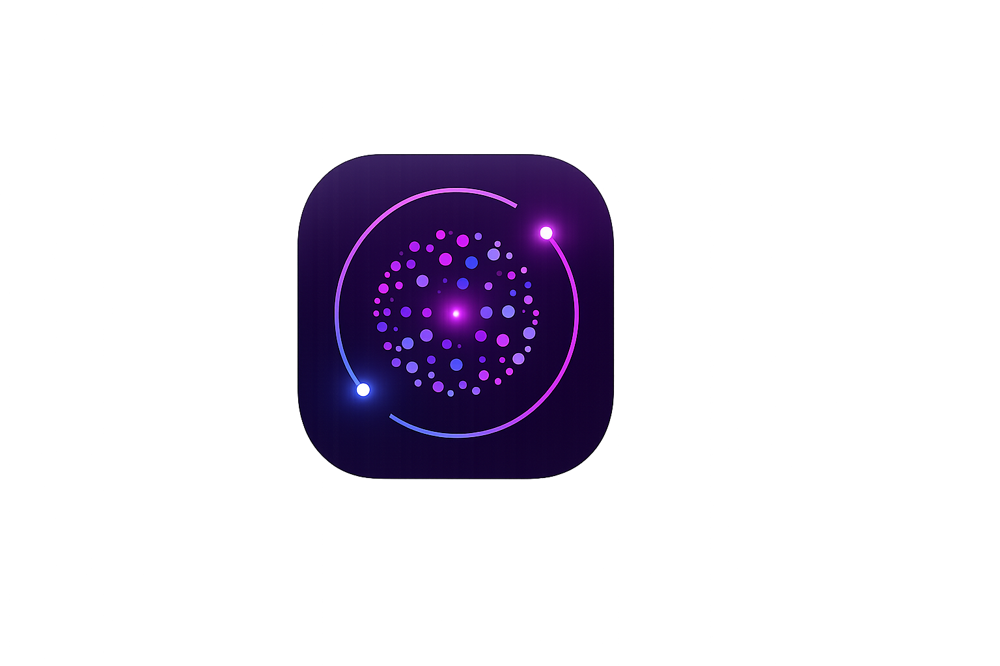

<div align="center">



# VUXIO AI

**A next-generation conversational AI assistant with streaming responses, web search, and a dedicated Code Mode — built from scratch by Simão.**

[](https://react.dev)
[](https://www.typescriptlang.org)
[](https://vitejs.dev)
[](https://firebase.google.com)
[](https://tailwindcss.com)
[](./LICENSE)

[Live Demo](https://vuxio-ai.vercel.app) · [Report Bug](https://github.com/coelho26101009-source/VUXIO-AI/issues) · [Request Feature](https://github.com/coelho26101009-source/VUXIO-AI/issues)

</div>

---

## What is VUXIO?

VUXIO is a full-stack AI chat application that combines a beautiful, fluid interface with powerful language models. It's built entirely from scratch — no boilerplate, no templates. Every animation, every interaction, every API call was written by hand.

It ships with three distinct operating modes:

- **Standard Mode** — Warm, conversational assistant powered by GPT-OSS 120B via Groq
- **Code Mode** — Dedicated developer environment with Google Gemini 2.5 Pro, green theme, and full technical responses
- **Web Mode** — Real-time web search via Tavily, injecting current information into every AI response

---

## Features

### Core AI
| Feature | Details |
|---|---|
| **Streaming responses** | Token-by-token SSE streaming — text appears as it's generated |
| **Regenerate answer** | Re-run any response with higher temperature for a fresh take |
| **Copy message** | One-click copy on every AI message |
| **Chat titles** | Each conversation is titled from its first message |
| **Vision support** | Upload images in Standard Mode and images or PDFs in Code Mode |
| **Voice input** | Browser-native speech recognition in PT-PT |
| **Text-to-speech** | AI responses read aloud, with mute toggle |

### Modes
| Mode | Trigger | Model | Theme |
|---|---|---|---|
| **Standard** | Default | GPT-OSS 120B (Groq) | Purple |
| **Code Mode** | `MOD CODE` button | Gemini 2.5 Pro → Groq Compound fallback | Green |
| **Web Mode** | `WEB` button | GPT-OSS 120B + Tavily results | Cyan |

### Auth & Persistence
| Feature | Details |
|---|---|
| **Google Sign-In** | Firebase Authentication with redirect flow |
| **Guest mode** | Full chat without an account — no persistence |
| **Chat history** | Stored per-user in Firestore, synced in real time |
| **Delete chats** | Double-confirm delete to prevent accidents |
| **Per-chat Code Mode flag** | Each saved chat remembers which mode it was created in |

### Settings, Memory & Connectors
| Feature | Details |
|---|---|
| **Settings panel** | Default mode, temperature, memory toggle, MCP servers, clear-all-chats — stored on the user's Firestore document |
| **Cross-chat memory** | `/remember <text>` in the composer saves an entry the AI sees in every future chat; explicit only, nothing is auto-extracted |
| **MCP connectors** | Remote HTTP MCP servers only (see *Architecture Notes*) — their tools are discovered and merged with `create_file` on every chat turn |

### UI & Experience
| Feature | Details |
|---|---|
| **Animated 3D sphere** | 90-dot orbital particle sphere in the welcome screen |
| **Animated avatar** | Compact version in chat — pulses while AI is typing |
| **Markdown rendering** | Full GFM support — tables, lists, bold, italic |
| **Syntax highlighting** | Fenced code blocks with language labels and copy button |
| **Code file download** | Download generated code files directly from the chat |
| **Collapsible sidebar** | Slide-out on mobile, persistent on desktop |
| **Live clock** | Real-time HH:MM:SS and date in the header |
| **Web search indicator** | Cyan "Searching the web..." state before streaming begins |
| **Responsive design** | Works on mobile, tablet, and desktop |

---

## Tech Stack

### Frontend
- **[React 19](https://react.dev)** — UI framework with hooks and concurrent features
- **[TypeScript 5.9](https://www.typescriptlang.org)** — strict type safety throughout
- **[Vite 7](https://vitejs.dev)** — lightning-fast dev server and bundler
- **[Tailwind CSS 3](https://tailwindcss.com)** — utility-first styling, zero runtime CSS
- **[Lucide React](https://lucide.dev)** — consistent icon set
- **[React Markdown](https://github.com/remarkjs/react-markdown)** + **[react-syntax-highlighter](https://github.com/react-syntax-highlighter/react-syntax-highlighter)** — rich message rendering

### AI & APIs
- **[Groq API](https://groq.com)** — ultra-fast inference for GPT-OSS 120B (text), Qwen 3.6 27B (vision), and Compound (agentic Code Mode fallback)
- **[Google Gemini 2.5 Pro](https://deepmind.google/technologies/gemini/)** — Code Mode primary model, with automatic Groq fallback on any error Groq can serve instead
- **[Tavily Search API](https://tavily.com)** — real-time web search for grounded AI responses

### Backend / Infrastructure
- **[Firebase Authentication](https://firebase.google.com/products/auth)** — Google Sign-In with popup flow
- **[Firebase Firestore](https://firebase.google.com/products/firestore)** — real-time NoSQL database with subcollection structure
- **[Web Speech API](https://developer.mozilla.org/en-US/docs/Web/API/Web_Speech_API)** — browser-native TTS and STT

---

## Project Structure

```
vuxio-ai/
├── public/
│   ├── logovuxio.png          # Open Graph / social preview logo
│   ├── logojanelavuxio.png    # Browser tab favicon
│   ├── sitemap.xml            # SEO sitemap
│   └── robots.txt             # Search engine directives
│
├── src/
│   ├── components/
│   │   ├── ErrorBoundary.tsx  # Global crash boundary with recovery UI
│   │   ├── InputBar.tsx       # Message composer with file attachment support
│   │   ├── LoginScreen.tsx    # Auth screen — Google login + guest mode
│   │   ├── MarkdownMessage.tsx# GFM renderer with syntax highlight + code download
│   │   ├── Sidebar.tsx        # Chat history panel with CODE badges and delete
│   │   └── VuxioAvatar.tsx    # Animated avatar — connects, pulses, changes per mode
│   │
│   ├── config/
│   │   └── codeMode.ts        # UNUSED — superseded by api/chat.js (see Known issues)
│   │
│   ├── hooks/
│   │   ├── useAuth.ts         # Firebase Auth — Google login, guest mode, auth state
│   │   ├── useChat.ts         # Core logic — streaming, web search, Firestore, regenerate
│   │   └── useSpeech.ts       # Web Speech API — TTS + STT in PT-PT
│   │
│   ├── App.tsx                # Root component — layout, modes, message rendering
│   ├── firebase.ts            # Firebase app initialization from env vars
│   ├── index.css              # Global styles and Tailwind directives
│   ├── main.tsx               # React entry point with ErrorBoundary wrapper
│   └── types.ts               # Shared TypeScript types
│
├── .env                       # Local secrets (never committed)
├── .env.example               # Template for required environment variables
├── index.html                 # HTML shell with SEO meta tags and OG image
├── tailwind.config.js
├── tsconfig.json
└── vite.config.ts
```

---

## Getting Started

### Prerequisites

- Node.js 18+
- A [Firebase project](https://console.firebase.google.com) with Auth (Google provider) and Firestore enabled
- A [Groq API key](https://console.groq.com)
- A [Google AI Studio API key](https://aistudio.google.com) (for Gemini / Code Mode)
- A [Tavily API key](https://tavily.com) (for Web Mode)

### Installation

```bash
# Clone the repository
git clone https://github.com/coelho26101009-source/VUXIO-AI.git
cd VUXIO-AI

# Install dependencies
npm install

# Set up environment variables
cp .env.example .env
# Fill in your keys (see section below)

# Start the frontend dev server
npm run dev

# To test chat and serverless API locally, use the Vercel CLI instead
npx vercel dev
```

### Environment Variables

Create a `.env` file at the project root with the following variables:

```env
# Server-only keys (set these in Vercel too; never prefix them with VITE_)
# Groq (Standard Mode + Code Mode fallback)
GROQ_API_KEY=your_groq_api_key

# Google Gemini (Code Mode primary model)
GEMINI_API_KEY=your_gemini_api_key

# Tavily (Web Mode real-time search)
TAVILY_API_KEY=your_tavily_api_key

# Firebase
VITE_FIREBASE_API_KEY=your_firebase_api_key
VITE_FIREBASE_AUTH_DOMAIN=your_project.firebaseapp.com
VITE_FIREBASE_PROJECT_ID=your_project_id
VITE_FIREBASE_STORAGE_BUCKET=your_project.firebasestorage.app
VITE_FIREBASE_MESSAGING_SENDER_ID=your_sender_id
VITE_FIREBASE_APP_ID=your_app_id
VITE_FIREBASE_MEASUREMENT_ID=G-XXXXXXXXXX
```

> **Note:** Never commit your `.env` file. Only Firebase's `VITE_FIREBASE_*` configuration is public; the AI and search keys are server-only.

### Firestore Setup

Enable Firestore in your Firebase project and apply these security rules:

```
rules_version = '2';
service cloud.firestore {
  match /databases/{database}/documents {
    match /users/{userId}/{document=**} {
      allow read, write: if request.auth != null && request.auth.uid == userId;
    }
  }
}
```

The Firestore data model uses nested subcollections:
```
users/
  {uid}/                 ← email, displayName, lastSeen,
                            settings { defaultMode, temperature, memoryEnabled },
                            memories [ { id, text, createdAt } ] (max 20),
                            mcpServers [ { id, name, url } ] (max 5)
    chats/
      {chatId}/          ← title, isCodeMode, createdAt, updatedAt
        messages/
          {msgId}        ← id, source, text, timestamp, createdAt
```

### Build & Deploy

```bash
# Production build
npm run build

# Preview the production build locally
npm run preview
```

VUXIO uses a server-side `/api/chat` function, so deploy it to **[Vercel](https://vercel.com)** (or another host that supports Node serverless functions). Set `GROQ_API_KEY`, `GEMINI_API_KEY`, and `TAVILY_API_KEY` in the host's environment-variable dashboard; do not expose them in the frontend.

---

## Architecture Notes

### Streaming
The browser calls `/api/chat`, which keeps provider keys on the server. The function streams Groq or Gemini output through **Server-Sent Events (SSE)**. Each chunk is accumulated by the client and displayed immediately, creating the typewriter effect without exposing AI credentials.

### Stale Closure Prevention
`useChat` maintains `useRef` mirrors of all frequently-changing values (`user`, `logs`, `currentChatId`, `codeMode`, `webMode`). All callbacks are wrapped in `useCallback` and read from refs, ensuring they never close over stale state.

### Regenerate
When regenerating, VUXIO strips the last AI response from the history, re-sends the last user message with `temperature: 1.0` (vs 0.7 normally), and appends a system instruction to produce a different answer. The new response is appended to Firestore without overwriting the original.

### Web Mode
When Web Mode is active, the server searches Tavily (up to five results), injects the result snippets into the prompt, and returns source metadata to the client. The AI is instructed to cite sources using `[Title](URL)` markdown links.

### Code Mode Fallback
Gemini 2.5 Pro is the primary Code Mode model. On **any** error response Groq is able to serve instead, VUXIO falls back to Groq Compound with the same message history and no visible interruption. The condition is deliberately broad: it previously covered only `429` and `5xx`, so when a model was retired and Google began answering `404`, Code Mode failed outright instead of falling back. PDFs are the one case that still surfaces the error, since Groq cannot accept them.

### Memory
Memory is explicit only — typing `/remember <text>` in the composer is the only way an entry is created; nothing is extracted automatically from the conversation. Entries are capped at 20, 500 characters each, stored on the user's own Firestore document (not inside `chats/messages`), and injected into the system prompt as a clearly-tagged section only when the memory toggle in Settings is on. `api/chat.js` re-validates the array it receives (bounded count and length) rather than trusting the client.

### MCP Connectors — remote HTTP only
`api/chat.js` can call remote MCP servers (`tools/list` / `tools/call` over MCP's HTTP JSON-RPC transport) and merge their tools with `create_file`, namespaced by server index (`mcp0_<tool>`, `mcp1_<tool>`, ...) so a tool name a server sends can't collide with `create_file` or with another server. Two things this **cannot** do, and why:

- **No local/stdio MCP servers.** A browser cannot spawn a subprocess, so only servers reachable over HTTP are configurable.
- **No session persisted across chat turns.** `api/chat.js` is a stateless Vercel function — every chat turn that has MCP servers configured re-runs the MCP `initialize` handshake for each of them from scratch, rather than reusing a session from the previous message. This adds latency per turn (bounded by a per-server timeout, run in parallel across servers) but is unavoidable without adding external session storage, which was explicitly out of scope. Discovery is skipped entirely when it can't be used anyway — an image attachment forces the vision model, which drops every tool — so an image upload isn't held waiting on servers it will never query.

A server that times out, errors, or returns a non-spec-compliant tool schema degrades to "no tools from that server" instead of failing the whole chat: a schema that isn't a valid `{ type: 'object', ... }` (or one implausibly large) is replaced with an empty schema before it ever reaches Groq, and if a completion still fails while MCP tools are attached, the handler retries once with tools stripped so the user gets a text answer instead of only an `event: error`. Two tools whose names sanitize to the same 59-character prefix get a numeric suffix instead of one silently overwriting the other in the tool lookup table used to route a call back to the right server. When the model does call a tool, the result is fed back for a real follow-up answer, bounded to `MAX_TOOL_ROUNDS`; the final round always runs with tools omitted, so a model that keeps calling tools instead of answering still has to produce text rather than leaving the reply blank.

**SSRF.** `handler` has no authentication, only a per-IP rate limit, and fetches whatever MCP server URL the client supplies. `validate()` rejects anything other than `https:`, and rejects hostnames that are literal loopback/private/link-local addresses (`127.0.0.0/8`, `10.0.0.0/8`, `172.16.0.0/12`, `192.168.0.0/16`, `169.254.0.0/16`, `0.0.0.0`, IPv6 `::1`, `::`, `fc00::/7`, `fe80::/10`) or well-known internal hostnames (`localhost`, `*.localhost`, `metadata.google.internal`). This only catches addresses written literally in the URL — it cannot catch a public hostname that *resolves* to a private IP at connect time (DNS rebinding), since the server fetches the given URL directly with no resolve-then-check step in between.

---

## Roadmap

- [ ] Message editing (re-send with edited text)
- [ ] Multi-model picker in the header
- [ ] Conversation export (Markdown / JSON)
- [ ] Image generation mode
- [ ] Shareable conversation links

---

## Models and tools in use

Every model ID below was checked against its provider's own current
documentation, not carried over from an earlier version. Provider model IDs
get retired without the calling code changing, and a retired ID fails only at
runtime — see *Known issues* for three that had already broken this way.

| Where | ID | Why this one |
|---|---|---|
| Standard Mode (text) | `openai/gpt-oss-120b` | Groq production model, 500 T/sec |
| Vision (image upload) | `qwen/qwen3.6-27b` | The model Groq's vision docs currently document for image input |
| Code Mode (primary) | `gemini-2.5-pro` | Google's current model aimed at deep reasoning and code |
| Code Mode (fallback) | `groq/compound` | Agentic — built-in code execution, which suits Code Mode |
| Web search | Tavily `/search` | Up to five results, injected as prompt context with sources returned to the client |

**Groq Compound** is an agentic system rather than a plain text model: it can
run code and search the web on its own, which is why it backs Code Mode rather
than the general chat path.

Provider limits worth knowing, from their docs: Groq vision accepts a maximum
of **5 images** and **20 MB** per request. This app is stricter — a single
attachment, capped at **3 MB**, because Vercel's serverless request limit is
4.5 MB and the base64 encoding plus JSON overhead has to fit inside it.

---

## Known issues

- **`src/config/codeMode.ts` is dead code.** Neither `CODE_MODEL` nor
  `buildCodeSystemPrompt` is imported anywhere — both were superseded when the
  prompts and model selection moved server-side into `api/chat.js`. It is left
  in place rather than deleted, but it is not what runs, and it should not be
  edited expecting an effect.
- **The rate limiter is per-instance.** `api/chat.js` keeps its counters in a
  module-level `Map`, so each serverless instance counts separately and a cold
  start resets them. Fine as abuse dampening; it is not a global quota.

---

## Contributors

- **[Simão (@coelho26101009-source)](https://github.com/coelho26101009-source)** — creator and author of VUXIO AI
- **[@otzpt](https://github.com/otzpt)** — model migration off decommissioned providers, Tavily auth fix, Code Mode fallback fix, regression tests

---

## License

Copyright © 2025 **Simão**. All rights reserved.

This project is licensed under the [MIT License](./LICENSE) — you're free to use and modify it, as long as you keep credit to the original author.

---

<div align="center">
  <sub>Built with passion by Simão &nbsp;·&nbsp; VUXIO AI v1.0</sub>
</div>
